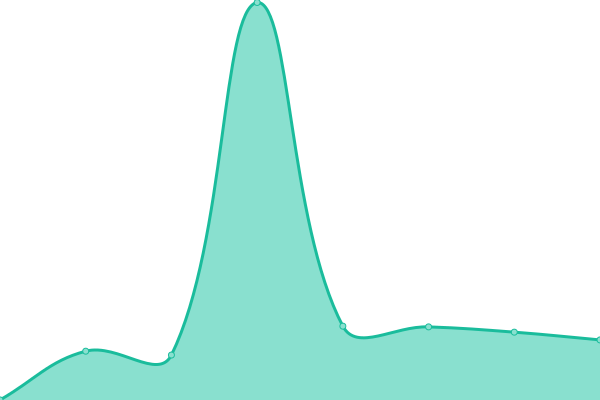

# [📈 Live Status](https://ymiranda-web.github.io/istmo-status): <!--live status--> **🟩 All systems operational**

This repository contains the open-source uptime monitor and status page for [Luis Yair Miranda Gonzalez](http://yairmiranda.com), powered by [Upptime](https://github.com/upptime/upptime).

With [Upptime](https://upptime.js.org), you can get your own unlimited and free uptime monitor and status page, powered entirely by a GitHub repository. We use [Issues](https://github.com/ymiranda-web/istmo-status/issues) as incident reports, [Actions](https://github.com/ymiranda-web/istmo-status/actions) as uptime monitors, and [Pages](https://ymiranda-web.github.io/istmo-status) for the status page.

<!--start: status pages-->
<!-- This summary is generated by Upptime (https://github.com/upptime/upptime) -->
<!-- Do not edit this manually, your changes will be overwritten -->
<!-- prettier-ignore -->
| URL | Status | History | Response Time | Uptime |
| --- | ------ | ------- | ------------- | ------ |
|  [Core Istmo](https://wolf.istmo.tecnm.mx) | 🟩 Up | [core-istmo.yml](https://github.com/ymiranda-web/istmo-status/commits/HEAD/history/core-istmo.yml) | 

 357ms
     
 | 

<a href="https://ymiranda-web.github.io/istmo-status/history/core-istmo">80.32%</a>
    

|  [Cliente Istmo](https://sit.istmo.tecnm.mx) | 🟩 Up | [cliente-istmo.yml](https://github.com/ymiranda-web/istmo-status/commits/HEAD/history/cliente-istmo.yml) | 

 308ms
     
 | 

<a href="https://ymiranda-web.github.io/istmo-status/history/cliente-istmo">80.74%</a>
    

|  [Sistema de Pagos](https://pagos.itistmo.edu.mx) | 🟩 Up | [sistema-de-pagos.yml](https://github.com/ymiranda-web/istmo-status/commits/HEAD/history/sistema-de-pagos.yml) | 

 639ms
     
 | 

<a href="https://ymiranda-web.github.io/istmo-status/history/sistema-de-pagos">72.87%</a>
    

|  [SII - ItIstmo](https://sii.itistmo.edu.mx) | 🟩 Up | [sii-it-istmo.yml](https://github.com/ymiranda-web/istmo-status/commits/HEAD/history/sii-it-istmo.yml) | 

 402ms
     
 | 

<a href="https://ymiranda-web.github.io/istmo-status/history/sii-it-istmo">4.72%</a>
    

|  [Recursos](https://recursos.wolf.istmo.tecnm.mx) | 🟩 Up | [recursos.yml](https://github.com/ymiranda-web/istmo-status/commits/HEAD/history/recursos.yml) | 

 526ms
     
 | 

<a href="https://ymiranda-web.github.io/istmo-status/history/recursos">80.74%</a>
    

<!--end: status pages-->

[**Visit our status website →**](https://ymiranda-web.github.io/istmo-status)

## 📄 License

- Powered by: [Upptime](https://github.com/upptime/upptime)
- Code: [MIT](./LICENSE) © [Luis Yair Miranda Gonzalez](http://yairmiranda.com)
- Data in the `./history` directory: [Open Database License](https://opendatacommons.org/licenses/odbl/1-0/)
